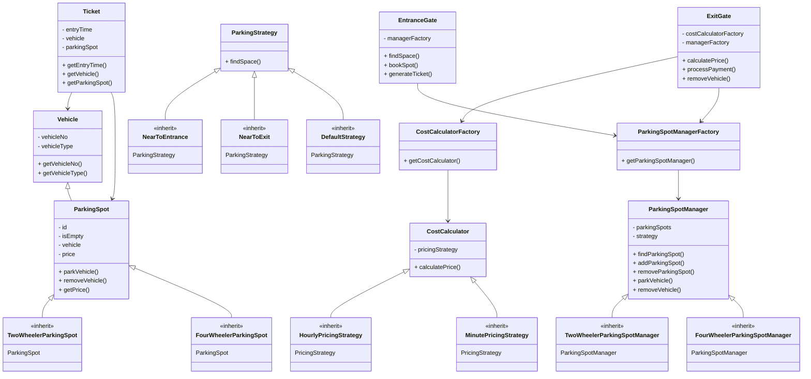

```mermaid
classDiagram
    class Vehicle {
        - vehicleNo
        - vehicleType
        + getVehicleNo()
        + getVehicleType()
    }

    class ParkingSpot {
        - id
        - isEmpty
        - vehicle
        - price
        + parkVehicle()
        + removeVehicle()
        + getPrice()
    }

    class Ticket {
        - entryTime
        - vehicle
        - parkingSpot
        + getEntryTime()
        + getVehicle()
        + getParkingSpot()
    }

    class TwoWheelerParkingSpot {
        <<inherit>> 
        ParkingSpot
    }

    class FourWheelerParkingSpot {
        <<inherit>> 
        ParkingSpot
    }

    class ParkingSpotManager {
        - parkingSpots
        - strategy
        + findParkingSpot()
        + addParkingSpot()
        + removeParkingSpot()
        + parkVehicle()
        + removeVehicle()
    }

    class TwoWheelerParkingSpotManager {
        <<inherit>> 
        ParkingSpotManager
    }

    class FourWheelerParkingSpotManager {
        <<inherit>> 
        ParkingSpotManager
    }

    class ParkingStrategy {
        + findSpace()
    }

    class NearToEntrance {
        <<inherit>> 
        ParkingStrategy
    }

    class NearToExit {
        <<inherit>> 
        ParkingStrategy
    }

    class DefaultStrategy {
        <<inherit>> 
        ParkingStrategy
    }

    class CostCalculator {
        - pricingStrategy
        + calculatePrice()
    }

    class HourlyPricingStrategy {
        <<inherit>> 
        PricingStrategy
    }

    class MinutePricingStrategy {
        <<inherit>> 
        PricingStrategy
    }

    class CostCalculatorFactory {
        + getCostCalculator()
    }

    class ParkingSpotManagerFactory {
        + getParkingSpotManager()
    }

    class EntranceGate {
        - managerFactory
        + findSpace()
        + bookSpot()
        + generateTicket()
    }

    class ExitGate {
        - costCalculatorFactory
        - managerFactory
        + calculatePrice()
        + processPayment()
        + removeVehicle()
    }

    Vehicle <|-- ParkingSpot
    ParkingSpot <|-- TwoWheelerParkingSpot
    ParkingSpot <|-- FourWheelerParkingSpot
    ParkingSpotManager <|-- TwoWheelerParkingSpotManager
    ParkingSpotManager <|-- FourWheelerParkingSpotManager
    ParkingStrategy <|-- NearToEntrance
    ParkingStrategy <|-- NearToExit
    ParkingStrategy <|-- DefaultStrategy
    CostCalculator <|-- HourlyPricingStrategy
    CostCalculator <|-- MinutePricingStrategy
    EntranceGate --> ParkingSpotManagerFactory
    ExitGate --> CostCalculatorFactory
    ExitGate --> ParkingSpotManagerFactory
    CostCalculatorFactory --> CostCalculator
    ParkingSpotManagerFactory --> ParkingSpotManager
    Ticket --> Vehicle
    Ticket --> ParkingSpot
```