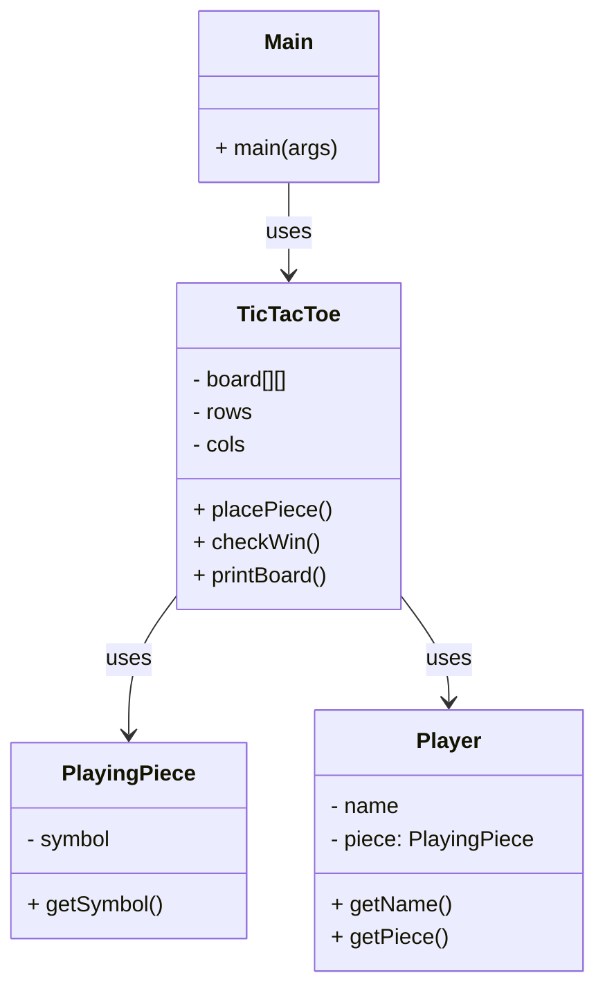

```mermaid
classDiagram
    class Main {
        + main(args)
    }

    class TicTacToe {
        - board[][]
        - rows
        - cols
        + placePiece()
        + checkWin()
        + printBoard()
    }

    class PlayingPiece {
        - symbol
        + getSymbol()
    }

    class Player {
        - name
        - piece: PlayingPiece
        + getName()
        + getPiece()
    }

    Main --> TicTacToe : uses
    TicTacToe --> PlayingPiece : uses
    TicTacToe --> Player : uses
```